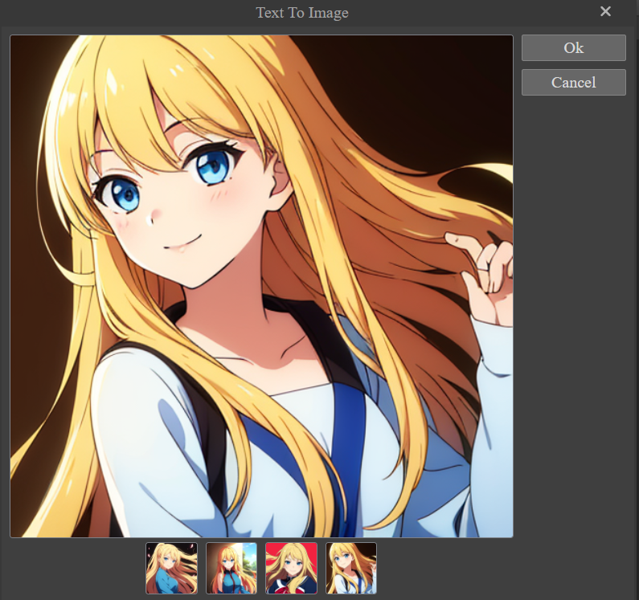

# Sokongan AI

<p align="center">
    
</p>

Aplikasi ini tidak datang dengan AI backend atas sebab - sebab tertentu seperti saiz model AI yang sangat besar (>3GB). Disebabkan oleh ini, pengguna perlu menyediakan AI backend sendiri. Terdapat dua jenis backend yang disokong oleh aplikasi ini:

- [Automatic1111](https://github.com/AUTOMATIC1111/stable-diffusion-webui)
- [ComfyUI](https://github.com/comfyanonymous/ComfyUI)

Pengguna hanya perlu memilih salah satu backend yang disokong. Cara - cara install dan penggunaan backend tersebut boleh dilihat di link yang telah diberikan. Selain itu, pengguna juga perlu memuat turun model AI sendiri. Model AI boleh dicari dan dimuat turn di [Civit AI](https://civitai.com/). Pastikan model AI yang telah dimuat turun diletak di dalam folder yang sepatutnya. 

### Automatic1111
Untuk menyambungkan backend ini ke aplikasi ini, pengguna terlebih dahulu perlu mengaktifkan ciri - ciri tambahan backend ini. Pergi ke stable-diffusion-webui > webui-user.bat dan klik kanan dan pilih edit. Di bahagian "set COMMANDLINE_ARGS=" sila isi seperti di bawah:

```
@echo off

set PYTHON=
set GIT=
set VENV_DIR=
set COMMANDLINE_ARGS= --api --cors-allow-origins *

call webui.bat

```

### ComfyUI
Untuk Comfy backend pula, pergi ke ComfyUI_windows_portable > run_nvidia_gpu.bat dan klik kanan dan pilih edit. Sila lengkapkan seperti di bawah:

```
.\python_embeded\python.exe -s ComfyUI\main.py --windows-standalone-build --enable-cors-header
pause

```

### Sambungan Ke Canvas Studio
Setelah pengguna telah melakukan perkara di atas, pengguna boleh memulakan backend tersebut. Sila tunggu sehingga backend tersebut selesai dimulakan. Untuk mula menyambungkan backend tersebut ke aplikasi ini, pergi di bahagian AI di bahagian kanan atas dan klik butang gear. Pengurus AI akan dibuka dan disini pengguna perlu memilih backend yang mahu digunakan. 

<p align="center">
    
</p>

Tekan butang Test untuk mulakan penyambungan. Jika penyambungan berjaya, mesej "Backend Connected" akan dipaparkan. 

### Fungsi - Fungsi AI
Setelah pengguna telah berjaya menyambungkan backend tersebut, pengguna boleh menggunakan fungs-fungsi AI yang sedia ada. Antara fungsi - fungsi yang disediakan ialah:

- Teks Ke Imej
- Imej Ke Imej
- Inpainting

Untuk inpainting, pengguna perlu menggunakan alat seperti magic wand atau lasso untuk memilih kawasan yang ingin diubah suai. 

Tekan butang Generate untuk menjana imej. Masa yang diperlukan untuk menjana imej bergantung kepada kemampuan komputer pengguna. Sila rujuk kepada cmd untuk melihat proses penjanaan imej tersebut. Hasil penjanaan imej akan dipaparkan setelah backend tersebut telah selesai menjana imej tersebut.

<p align="center">
    
</p>
